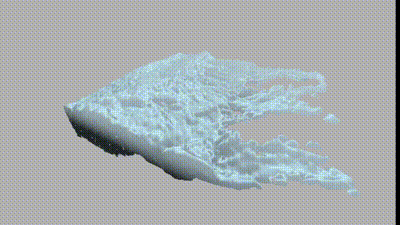
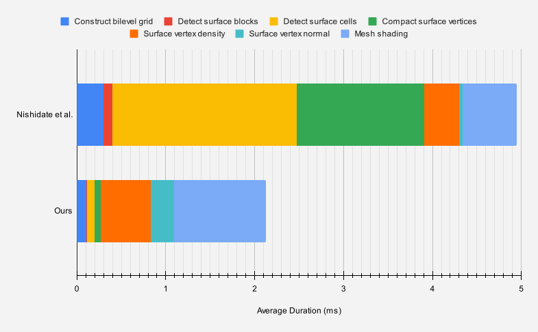
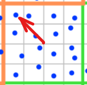
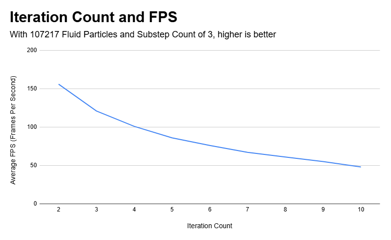
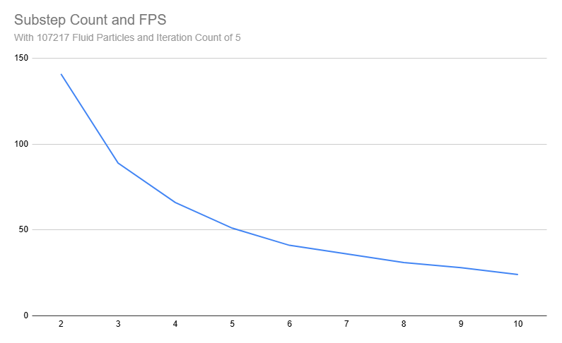
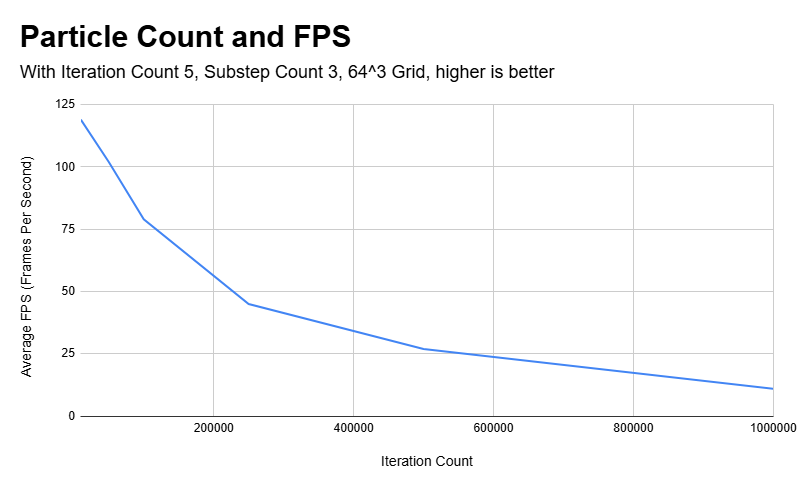
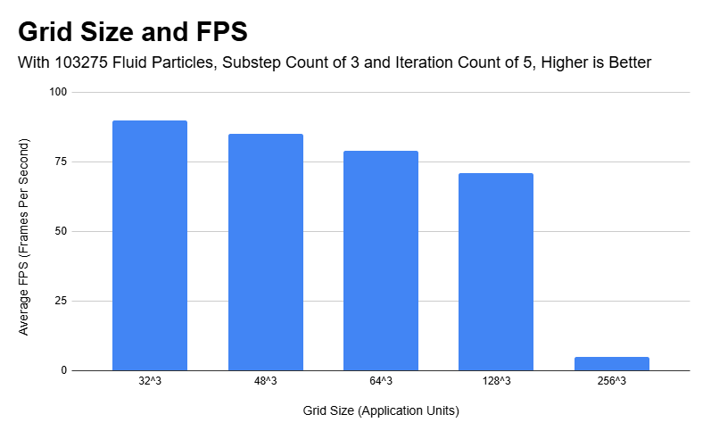
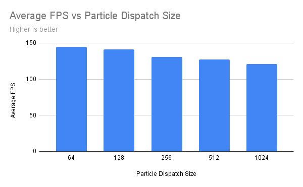
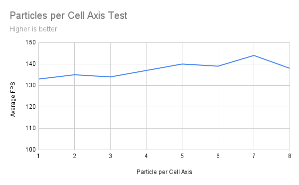
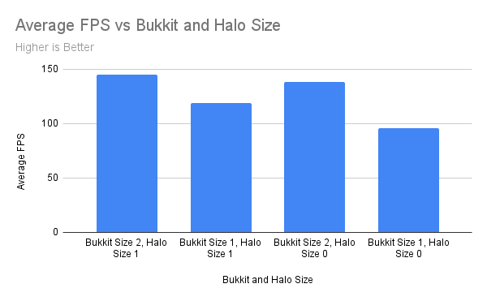

*Breakpoint* is a project created by Daniel Gerhardt, Dineth Meegoda, Matt Schwartz, and Zixiao Wang, for CIS 5650 GPU Programming at the University of Pennsylvania.

Our project combines a novel particle simulation technique - PBMPM, developed by EA - with a state-of-the-art fluid surface construction method, using mesh shading and a bilevel-grid, all running in real time. 

# Project Overview

## DirectX Core

We built our project on top of the DirectX 12 graphics API, creating our own engine infrastructure with guidance from the DX documentation, samples, and tutorial series by Ohjurot. Our engine includes wrapper classes for central DirectX concepts such as structured buffers and descriptor heaps. It also provides scene constructs with support for standard vertex render pipelines, mesh-shading pipelines, and compute pipelines. With these, we can render meshes from OBJ files, PBMPM particles, and mesh-shaded fluid surfaces. The default scene includes an FPS camera and mouse interaction with the PBMPM particle simulation.

For the graphical interface (which includes interactive sliders for the simulation and rendering parameters), we used ImGUI.

## PBMPM

The public repository for PBMPM includes a 2D, non-optimized version of the simulation. We hope to expand this to 3D, and add shared memory GPU optimizations to PBMPM to make it real time in DirectX. We have had trouble setting up the grid to play well with our camera and object scale as well as volume preservation, and moving to 3D has caused some further issues with particle movement.

PBMPM works by putting particles into a grid of bukkits, allocating work per bukkit, and then enforcing movement constraints per material per bukkit. The bukkits have a halo range so the particles can react to the movement of particles within neighboring bukkits.

As of milestone 3, the 2D implementation has working bucketing, mouse movement for forces, and sand, snow, and liquid materials. In 2D gravity is applied and particles interact, but volume loss and noise are prevalent in the system. In 3D, the forces are not applied properly, and there is an unknown bug causing the particles to move up and to the right.

### Materials

Most of the materials we have are based on the original public PBMPM paper 2D materials implementations (liquid, sand, elastics, Visco). However, the snow is mainly based on Disney's work about [A material point method for snow simulation](https://media.disneyanimation.com/uploads/production/publication_asset/94/asset/SSCTS13_2.pdf). The snow material implementation combines elastic deformation (reversible) with plastic deformation (permanent) using a multiplicative decomposition approach. This creates a material that can both temporarily deform and permanently change shape. 

#### Liquid
The liquid material implementation in our MPM system combines volume preservation with viscosity control to simulate fluid behavior. The implementation is primarily based on the Position Based Fluids (PBF) approach, adapted for the MPM grid-based framework.


The main liquid update happens in the constraint solving phase:
``` 
if (particle.material == MaterialLiquid)
{
    // Simple liquid viscosity: just remove deviatoric part of the deformation displacement
    float3x3 deviatoric = -1.0 * (particle.deformationDisplacement + transpose(particle.deformationDisplacement));
    particle.deformationDisplacement += g_simConstants.liquidViscosity * 0.5 * deviatoric;

    float alpha = 0.5 * (1.0 / liquidDensity - tr3D(particle.deformationDisplacement) - 1.0);
    particle.deformationDisplacement += g_simConstants.liquidRelaxation * alpha * Identity;
}
```

### Sand

The sand implementation is based on the [Drucker-Prager plasticity model](https://dl.acm.org/doi/10.1145/2897824.2925906). 


The main update loop handles the elastic-plastic decomposition of deformation and volume preservation.

```
    // Step 1: Compute total deformation gradient
    float3x3 F = mul(Identity + particle.deformationDisplacement, particle.deformationGradient);
    
    // Step 2: Perform SVD decomposition
    SVDResult svdResult = svd(F);
    
    // Step 3: Safety clamp singular values
    svdResult.Sigma = clamp(svdResult.Sigma,
        float3(0.1, 0.1, 0.1),
        float3(10000.0, 10000.0, 10000.0));
        
    // Step 4: Volume preservation
    float df = det(F);  // Current volume
    float cdf = clamp(abs(df), 0.4, 1.6);  // Clamp volume change
    float3x3 Q = mul((1.0f / (sign(df) * cbrt(cdf))), F);  // Volume preserving target
    
    // Step 5: Elastic-plastic blending
    float3x3 elasticPart = mul(mul(svdResult.U, diag(svdResult.Sigma)), svdResult.Vt);
    float3x3 tgt = alpha_blend * elasticPart + (1.0 - alpha_blend) * Q;
```

### Visco

The Visco material model in this project represents a highly viscous, non-Newtonian fluid-like material that bridges the gap between purely elastic solids and fully fluid materials. It is intended for scenarios where you want to simulate materials that flow under prolonged stress but still maintain some structural integrity under short loading times—such as pitch, wax, or thick mud. By carefully tuning the parameters, you can achieve a range of behaviors from a slow-creeping putty to a thick slurry.


```
    // Step 1: Compute deformation gradient
    float3x3 F = mul(Identity + particle.deformationDisplacement, particle.deformationGradient);
    
    // Step 2: SVD decomposition
    SVDResult svdResult = svd(F);
    
    // Step 3: Get current volume
    float J = svdResult.Sigma.x * svdResult.Sigma.y * svdResult.Sigma.z;
    
    // Step 4: Clamp deformation within yield surface
    svdResult.Sigma = clamp(svdResult.Sigma,
        float3(1.0 / yieldSurface, 1.0 / yieldSurface, 1.0 / yieldSurface),
        float3(yieldSurface, yieldSurface, yieldSurface));
    
    // Step 5: Volume preservation
    float newJ = svdResult.Sigma.x * svdResult.Sigma.y * svdResult.Sigma.z;
    svdResult.Sigma *= pow(J / newJ, 1.0 / 3.0);
    
    // Step 6: Update deformation gradient
    particle.deformationGradient = mul(mul(svdResult.U, diag(svdResult.Sigma)), svdResult.Vt);
```

### Elastic

The Elastic material in this project simulates a solid-like material that deforms under load but returns to its original shape once forces are removed, analogous to rubber or soft metals (in their elastic range). It is the simplest and most fundamental of the material implemented, serving as a baseline for understanding more complex behaviors like plasticity or viscosity.


Unlike plastic or granular materials, the Elastic material does not accumulate permanent changes. Once the external force or displacement is removed, the elastic material returns to its initial state. If you stretch it and let go, it rebounds. So there is no need to update and accumulate the deform shape, the main update loop is in the particles update section.
```
    // Step 1: Compute deformation gradient
    float3x3 F = mul(Identity + particle.deformationDisplacement, particle.deformationGradient);
    
    // Step 2: SVD decomposition
    SVDResult svdResult = svd(F);

    // Step 3: Volume preservation
    float df = det(F);
    float cdf = clamp(abs(df), 0.1, 1000.0);
    float3x3 Q = mul((1.0 / (sign(df) * cbrt(cdf))), F);
    
    // Step 4: Combine rotation and volume preservation
    float alpha = elasticityRatio;
    float3x3 rotationPart = mul(svdResult.U, svdResult.Vt);
    float3x3 targetState = alpha * rotationPart + (1.0 - alpha) * Q;
    
    // Step 5: Update displacement
    float3x3 invDefGrad = inverse(particle.deformationGradient);
    float3x3 diff = mul(targetState, invDefGrad) - Identity - particle.deformationDisplacement;
    particle.deformationDisplacement += elasticRelaxation * diff;
```

### Snow

The Snow material model is based on the elastoplastic framework described in [Stomakhin et al. 2013, A Material Point Method for Snow Simulation](https://media.disneyanimation.com/uploads/production/publication_asset/94/asset/SSCTS13_2.pdf). This model treats snow as a porous, elastoplastic medium that resists deformation elastically up to certain critical thresholds, after which it undergoes permanent (plastic) rearrangements. The approach enables simulating both firm, rigid snowpacks and flowing avalanches within a unified formulation.


Unlike purely elastic materials, snow undergoes permanent changes when overstressed. The deformation gradient F is multiplicatively decomposed into elastic (Fe) and plastic (Fp) components:

* Elastic Component (Fe): Captures recoverable deformations. When loads are removed, Fe tends toward the identity, restoring the material to its original shape (as long as the deformation stays under critical thresholds).
* Plastic Component (Fp): Records permanent rearrangements of the snow’s internal structure. Changes in Fp are not reversed upon unloading, reflecting crushed bonds or irreversibly compacted microstructure.

```
    // Step 1: SVD decomposition of deformation gradient
    SVDResult svdResult = svd(particle.deformationGradient);

    // Step 2: Elastic bounds
    float3 elasticSigma = clamp(svdResult.Sigma,
        float3(1.0f - criticalCompression, 1.0f - criticalCompression, 1.0f - criticalCompression),
        float3(1.0f + criticalStretch, 1.0f + criticalStretch, 1.0f + criticalStretch));

    // Step 3: Volume-based hardening
    float Je = elasticSigma.x * elasticSigma.y * elasticSigma.z;
    float hardening = exp(hardeningCoeff * (1.0f - Je));

    // Step 4: Elastic-plastic decomposition
    float3x3 Fe = mul(mul(svdResult.U, diag(elasticSigma)), svdResult.Vt);
    float3x3 FeInverse = mul(mul(svdResult.U, diag(1.0 / elasticSigma)), svdResult.Vt);
    float3x3 Fp = mul(particle.deformationGradient, FeInverse);
```
## Fluid Mesh Shading

<p align="center">
  
  <br>
  <i>Fluid data rendered with mesh shading, our implementation.</i>
  </br>
  <i>(data and technique from Nishidate et al)</i>
</p>

<p align="center">
  
  <br>
  <i>Fluid surface reconstruction - Nishidate et al.</i>
</p>

We use a novel approach for constructing the fluid surface's polygonal mesh, via a GPU-accelerated marching cubes based algorithm that utilizes mesh shaders to save on memory bandwidth. For the unfamiliar, mesh shading is a relatively new technology that replaces the vertex, primitive assembly, and other optional stages of the graphics pipeline with a single, programmable, compute-like stage. The mesh-shading stage provides ultimate flexibility and opportunity to optimize and reduce memory usage, at the cost of increased implementation complexity. Most notably, a mesh shader can only output a maximum of 256 vertices per "workgroup". This means that each workgroup of a mesh shader must work together, outputting individual "meshlets" to combine into the overall mesh:


<p align="center">
  
  <br>
  <i>Meshlets to meshes - Nishidate et al.</i>
</p>

Our specific usage of mesh shading follows [Nisidate et al.](https://dl.acm.org/doi/10.1145/3651285), which creates a bilevel uniform grid to quickly scan over fluid particles from coarse-to-fine, in order to build a density field. This density field is the input to the mesh shader, which runs marching cubes per grid cell to create a fluid surface mesh. By aligning each mesh shading workgroup with half a grid "block," this approach reduces vertex duplication at block-boundaries while staying under the 256-vertex limit. The general flow looks like this:

<p align="center">
  
  <br>
  <i>Technique overview - Nishidate et al.</i>
</p>

The above stages manifest as 6 compute passes and a mesh shading pass, which can be described as:
1. Building the grids (putting particles into cells and blocks)
2. Detecting which blocks are "surface" blocks
3. Detecting which cells are "surface" cells
4. Compacting vertices of all surface cells into a non-sparse array
5. Computing the density of particles at each surface vertex
6. Computing the normals at each surface vertex
7. (Mesh shading) Using marching cubes to triangulate the particle density field, then fragment shading (which uses the normals).

In the course of implementing these passes, we found many opportunities for significant performance improvements based on principle concepts taught in CIS 5650. To illustrate this, compare the average compute time (in milliseconds, averaged over 1,000 frames) for each step listed above between our implementation and the original:

| Algorithm step              | Nishidate et al. | Ours  |
|-----------------------------|------------------|-------|
| Construct bilevel grid      | 0.297            | 0.107 |
| Detect surface blocks       | 0.099            | 0.006 |
| Detect surface cells        | 2.074            | 0.083 |
| Compact surface vertices    | 1.438            | 0.072 |
| Surface vertex density      | 0.391            | 0.561 |
| Surface vertex normal       | 0.038            | 0.262 |
| Mesh shading                | 0.611            | 1.038 |
| **Total:**                  | **4.948**        | **2.129** |

<p align="center">
  
  <br>
  <i>Technique overview - Nishidate et al.</i>
</p>


*(Tested on: Windows 10 22H2, Intel(R) Core(TM) i7-10750H CPU @ 2.60GHz, NVIDIA GeForce RTX 2060)*

Let's discuss each step in the technique and analyze the optimizations (or lack thereof) that account for the differences in computation time:

### Construct the bilevel grid

In this step, particles are placed into blocks (the coarse structure) and cells (the fine structure). Threads are launched for each particle, and the particle's position determines its host cell. The first particle in each cell increments its block's count of non-empty cells, *as well as its neighboring blocks'*. In the original paper, they iterate over 27 neighboring blocks complex and use highly-divergent logic to narrow down to a maximum of 8 potential blocks close enough to be affected.

In our implementation, we use clever indexing math to calculate the iteration bounds for the exact 8 neighboring blocks a-priori, avoiding much of the divergent logic.

<p align="center">
  
  <br>
  <i>Indexing illustration</i>
</p>

By taking a vector from the center of a block to the cell represented by a given thread, we can remap that distance such that cells on the border of a block are ±1, and anything inside is 0. Not only does this tell us whether or not a cell is on a block boundary, it also gives us the directions we need to search for the 8 neighboring blocks 

```GLSL
    // (±1 or 0, ±1 or 0, ±1 or 0)
    // 1 indicates cell is on a positive edge of a block, -1 indicates cell is on a negative edge, 0 indicates cell is not on an edge
    // This should work for both even and odd CELLS_PER_BLOCK_EDGE
    float halfCellsPerBlockEdgeMinusOne = ((CELLS_PER_BLOCK_EDGE - 1) / 2.0);
    int3 edge = int3(trunc((localCellIndices - halfCellsPerBlockEdgeMinusOne) / halfCellsPerBlockEdgeMinusOne));

    ...

    int3 globalNeighborBlockIndex3d = clamp(blockIndices + edge, int3(0, 0, 0), gridBlockDimensions - 1);
    int3 minSearchBounds = min(blockIndices, globalNeighborBlockIndex3d);
    int3 maxSearchBounds = max(blockIndices, globalNeighborBlockIndex3d);
```

As you can see in the above results table, this single difference nearly tripled the performance of this step when compared to the original. A great example of the power of thread convergence!

### Detect surface blocks

In this step, we take the array of blocks, detect which are surface blocks (`nonEmptyCellCount > 0`), and put the indices of those surface blocks into a new, compact array. Each thread acts as a single block. The paper accomplishes this by having each surface-block thread atomically add against an index, and using that unique index to write into the output surface block indices array.

Both the issue with and solution to this approach was immediately obvious to us. The issue: heavy use of atomics creates high contention and is very slow. The solution: stream compaction! Stream compaction is widely used to do precisely this task: filter on an array and compress the desired entries into an output array.

<p align="center">
  
  <br>
  <i>Stream compaction illustrated</i>
</p>

With parallel prefix scan, 0 atomic operations are necessary. However, given our choice of framework and the lack of a library like Thrust, implementing a prefix scan in the timeframe of this project was out of scope. Instead, we opted for a simple, yet highly effective, wave-intrinsic approach, [based on this article](https://interplayoflight.wordpress.com/2022/12/25/stream-compaction-using-wave-intrinsics/). The gist is, each wave coordinates via intrinsics to get unique write-indices into the output array, needing only 1 atomic operation per-wave to sync with the other waves. With 32 threads per wave, this is a 32x reduction in atomic usage! The effect may amplify further, however, since there's much less chance of resource contention with such a reduction in atomic usage.

As such, it's no surprise that our implementation of this stage was over 16x faster than the original!

### Detect Surface Cells

In this next step, we move from the coarse-pass to the fine. Each thread in this pass, representing a single cell in a surface block, checks its neighboring 27 cells to determine if it is a surface cell. Surface cells are those which are neither completely surrounded by filled cells, nor by completely empty cells (itself included).

The great time-sink in the implementation used by Nishidate et al. is its heavy global memory throughput. Since each cells needs to reference all of its neighbors, that means each thread does 27 global memory accesses. Ouch! We realized, however, that many of these accesses are redundant. Consider two adjacent cells; each has 27 neighbors, but each shares 9 of those neighbors! The optimization opportunity improves exponentially when you consider that we're analyzing *blocks* of cells, with nearly complete neighbor overlap.

The solution, then, is to pull all cell data for a block into groupshared memory. This way, for a given block of 64 cells (4 x 4 x 4), instead of doing 27 * 64 = 1728 global memory reads, we only need to do 125 reads (5 x 5 x 5). Each cell still looks up neighboring information, but from shared memory instead of global memory. The indexing is somewhat complex to make sure that 64 threads can efficiently pull data for 125 cells, but we can actually reuse the trick from the bilevel grid construction to get the right iteration bounds!

And, once again, looking at the performance results above, we see a MASSIVE 25x increase in performance.

### Compact Surface Vertices

This is exactly the same idea as the wave intrinsic optimization done in detecting surface blocks, but with the surface vertices! Because there are so many more of these, the contention with atomic usage is exacerbated, thus the 20x performance increase!

### The rest

Aside from these major optimizations, there were also several smaller ones that we'll mention briefly:
- The original paper uses one-dimensional workgroup sizes. This results in a few places where expensive modular arithmetic must be used to convert from a 1D thread ID to a 3D index. By using a 3D workgroup size, which better aligns with the underlying model, we can avoid some (but not all) of that modular arithmetic
- TODO (need notes from other branch)

Now for the elephant in the room: why are the last 3 stages slower in our implementation? The short answer is: we're not exactly sure why, but we have theories!

- Surface vertex density and surface normals: our implementations for these passes are nearly identical to the original paper's. If anything, minor optimizations in these passes should have results in slightly faster times. 
  - Our best guess for the discrepancies are that our wave-intrinsic optimization in the vertex compaction stage somehow results in a less-ideal memory layout for following stages. 
  - These stages also appear to be highly sensitive to workgroup sizes, so it's possible that we just did not find the optimal configuration for our hardware. 
  - Lastly, some differences may be due to engine differences (being new to DirectX, we may not have written optimal engine code), and graphics API platforms (Vulkan + GLSL vs. DirectX + HLSL).
</br>
- Mesh shading: again, our implementation is similar to the original paper's. However, some steps in the original implementation are actually undefined behavior, forcing us to diverge slightly (these behaviors). 
  - Most notably, since mesh output sizes (number of vertices and primitives) must be declared before writing to them, we needed to use shared memory to store our vertex data first, then later write them to global memory.
  - There are a few early returns in the original implementation. We believe this is also undefined behavior in mesh shaders, with certain restrictions. We tried our best to accomplish the same computation-savings by similar means, but it may not be comparable.
  - Again, workgroup-size sensitivity and potentially engine differences.

## PBD Voxelization

The Mesh Mortal Kombat paper focuses on using PBD particles to seperate a mesh into pieces that can break apart like a realistic soft body. This works by enforcing distance constraints within the voxels and face to face constraints between them. We initially wanted to use PBMPM particles to cause the destruction of the soft body materials. However, as the project progressed and we hit milestone 2, we realized it was not realistic to get a working PBMPM and PBD integration. This is largely caused because there is not much detail on the math behind the constraints and approach used for the soft body destruction. We decided it was best to focus our time on a solid PBMPM rendering rather than trying to work out the details of the soft body destruction.

# Performance Review

## PBMPM

There are a number of parameters that affect how PBMPM performs, due to the complexity of the simulation algorithm. The following is a list of performance tests for PBMPM, analyzing the various parameters and attributes of the particle simulation. For the setup, unless otherwise stated the iteration and substep count are 5, the grid is 64x64x64, there are 2000 particles emitted by an initial emitter, mesh shading is on, the particles per cell axis is 4, and the fixed point multiplier is 7.

The primary 2 are the iteration count and substep count. The substep count runs bukkiting and emission as well as g2p2g for each update within a frame. The iteration count is a subroutine of substep count that determines how many times g2p2g is run within each substep. The two of these have major impacts on performance.





These parameters, along with many others that are tied to the simulation, are at the user's discretion to choose between performance, stability, and accuracy. Having a higher iteration and substep count will increase the stability and accuracy at the cost of performance. A nice sweet spot is what we used for our basic testing setup.



The simulation has an expected albeit high falloff in performance as particle count increases. The large memory overhead creates a big disparity in performance between high and low particle counts. This is the biggest determining factor in performance, because the number of dispatches is based in thef number of bukkits containing particles.



The grid size performance is connected to the number of bukkits within the grid. Generally as the grid grows, performance decreases, but due to the limit of memory in the 3d implementation, the grid could not be stably tested past 256x256x256. 32x32x32 is likely slower than 64x64x64 because it is more likely particles were reaching edge conditions and causing branching behavior due to border friction.


Grid dispatch size is the dispatch size for any compute shader that runs per grid cell. It didn't have a noticable performance impact outside the margin of error, and the simulation did not function when the grid dispatch was not between 4 and 10.



Particle dispatch size, similarly to grid dispatch, is the disaptch size for any compute shader that runs per particle. Performance decreased when particle dispatch size increased. This was a marginal decrease. It is likely caused by larger workgroups increasing the number of threads within a single workgroup that need to access memory.



Particles per cell axis is for 2 things. The first is the volume calculation, capping out how much volume can be allotted within a cell to the particles. The second use is emission - the amount of particles per cell axis is tied to the amount of cells emitted per axis. This did not affect performance past the margin of error, as the computations involved in the two use cases are both equally performant regardless of the value of particles per cell axis.



Bukkit size and bukkit halo size determine the size of the cells that particles are grouped into and how far particles can look around them to determine the influence of surrounding cells respectively. Due to the constraints of memory usage in 3D, the 4 configurations above are the only viable ones that allow the shaders to run. This is due to the shared memory limitation of DirectX 12, which is 32kb in compute shaders. Decreasing the bukkit size increases performance, as does bukkit halo size. The halo size has a greater effect, which is expected since the halo size increase causes a vast increase in the memory access of each thread. However, it is not advised to reduce these past 2 for bukkit size and 1 for halo size, since the simulation does not perform stably below these values. Ideally, these values could be increased, but because of shared memory limitations, they cannot be in the current implementation. One avenue of investigation is determining whether a greater bukkit size with no shared memory would yield performance improvements.

Helpful resources: 
- [PBMPM](https://www.ea.com/seed/news/siggraph2024-pbmpm)
- [Fluid Mesh Shading](https://dl.acm.org/doi/10.1145/3651285)
- [Disney Snow](https://media.disneyanimation.com/uploads/production/publication_asset/94/asset/SSCTS13_2.pdf)
- For the DX12 basics and compointer class, we used this great tutorial series resource: https://github.com/Ohjurot/D3D12Ez

# Citations / Attributions
```
@article{10.1145/3651285,
    author = {Nishidate, Yuki and Fujishiro, Issei},
    title = {Efficient Particle-Based Fluid Surface Reconstruction Using Mesh Shaders and Bidirectional Two-Level Grids},
    year = {2024},
    issue_date = {May 2024},
    publisher = {Association for Computing Machinery},
    address = {New York, NY, USA},
    volume = {7},
    number = {1},
    url = {https://doi.org/10.1145/3651285},
    doi = {10.1145/3651285},
    journal = {Proc. ACM Comput. Graph. Interact. Tech.},
    month = {may},
    articleno = {1},
    numpages = {14},
}
```